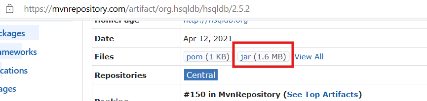
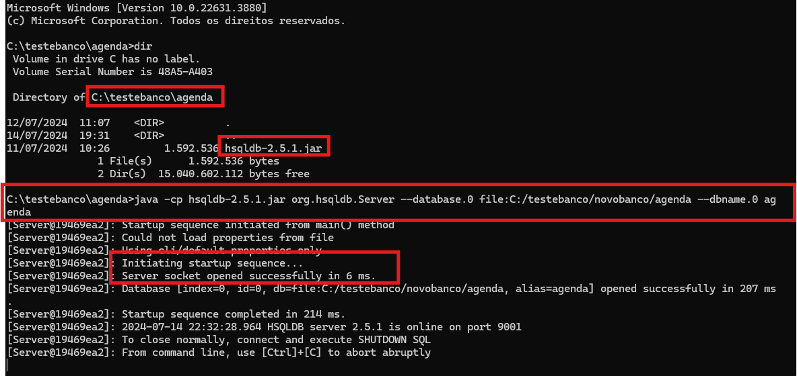
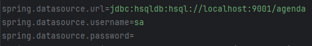
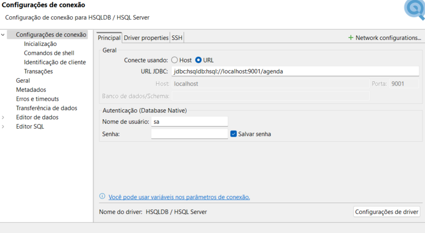

<h1 align="center">Controle de Agendamento</h1>
<center>
    
</center>

<h2>Índice</h2>

- [Resumo](#resumo)
- [Tecnologias utilizadas](#tecnologias-utilizadas)
- [Configuração do Ambiente](#variáveis-de-ambiente)
- [Execução local](#execução-local)
- [Filtros de consulta](#Filtros-de-consulta)
- [Testes Postman ](#Testes-Postman)

---

## Resumo

Este projeto é uma aplicação destinada ao controle de agendamentos de vagas. Ele permite o cadastro de vagas disponíveis, o registro de solicitantes, a criação de agendamentos de vagas e a realização de consultas detalhadas de agendamentos por período e por solicitante.

## Tecnologias utilizadas

A aplicação foi desenvolvida utilizando as seguintes tecnologias:


## Configuração do Ambiente

Certifique-se de que você tenha o seguinte ambiente configurado antes de executar a aplicação:

- [Java 17](https://www.oracle.com/java/technologies/downloads/#java17) ou versão compatível instalada.
- [Maven](https://maven.apache.org/docs/3.8.1/release-notes.html) instalado

## Execução local

1. Escolha sua IDE de preferência.


2. Configure as variáveis de ambiente do Java 17 e do Maven 3.8.1 na sua maquina local.


3. Clone o repositório do projeto em sua máquina local com o comando:


```shell
git clone https://github.com/fabiooliveirajjd/LogOne-Cadastro-de-Agendamento.git
```
4. Baixe o jar do banco 
[HSQLDB 2.5.2](https://mvnrepository.com/artifact/org.hsqldb/hsqldb/2.5.2)




5. Crie uma pasta para criar o banco localmente ex: C:/testebanco/agenda


6. Com o diretorio criado adicione o jar do hsqldb dentro do diretório execute o comando para criar o banco:

```shell
`java -cp hsqldb-2.5.1.jar org.hsqldb.Server --database.0 file:C:/testebanco/novobanco/agenda --dbname.0 agenda`
````



- Mantenha o banco no alto para que a aplicação possa se conectar.
7. Configure o application.properties com as informações do banco criado.


8. Configuração de conexão com o banco de dados HSQLDB no DBeaver.




9. Na raiz do projeto execute o seguinte comando para baixar as dependências.
```Shell
mvn clean install -DskipTests
```
10. Execute a aplicação com o comando:
```Shell
java -jar -Dserver.port=9494 target/Teste-Pratico-Desenvolvedor-Java-0.0.2-SNAPSHOT.jar
```
6. Acesse a aplicação localmente em seu navegador através do endereço: [http://localhost:9292/](http://localhost:9292/)


## Regras de Negócio 


| **Regras** | **Descrição**                                                                                                                                                                                                                                                |
|------------|--------------------------------------------------------------------------------------------------------------------------------------------------------------------------------------------------------------------------------------------------------------|
| RN-1       | Permitir o cadastro de vagas disponíveis.                                                                                                                                                                                                                     |
| RN-2       | Permitir o cadastro de solicitantes.                                                                                                                                                                                                                          |
| RN-3       | Permitir o cadastro de agendamentos de vagas.                                                                                                                                                                                                                 |
| RN-4       | Permitir a consulta de agendamentos por período.                                                                                                                                                                                                              |
| RN-5       | Vagas devem ter os seguintes campos: Início: Data início, Fim: Data fim, Quantidade: Quantidade de vagas em vigência.                                                                                                                                         |
| RN-6       | Solicitantes devem ter os seguintes campos: Nome: Nome da pessoa.                                                                                                                                                                                             |
| RN-7       | Agendamentos devem ter os seguintes campos: Data: Data do agendamento, Número: Número do agendamento, Motivo: Motivação para o agendamento, Solicitante: Pessoa que solicitou o agendamento.                                                                  |
| RN-8       | Consulta de agendamentos por solicitante passando o início, fim e o solicitante. Deve ser exibida a lista de solicitantes, total de agendamentos realizados, quantidade de vagas e percentual do total agendado x quantidade de vagas para o período informado. |
| RN-9       | O sistema não deve permitir o cadastro de vagas com datas retroativas (antes da data atual).                                                                                                                                                                  |  
| RN-10      | O sistema não deve permitir agendamentos para períodos onde não haja quantidade de vagas suficientes.                                                                                                                                                         | 
| RN-11      | O sistema não deve permitir cadastros de vários agendamentos para o mesmo solicitante. O limite máximo permitido será de 25% em relação à quantidade de vagas disponíveis para o período.                                                                     |   
| RN-12      | Todos os campos em todas as telas deverão ser obrigatórios.                                                                                                                                                                                                   |

- As regras de negócios referenciadas a cima estão também comentadas no código fonte onde são aplicadas nos métodos de serviço.
---
Desenvolvido por Fábio Santos Oliveira.


 